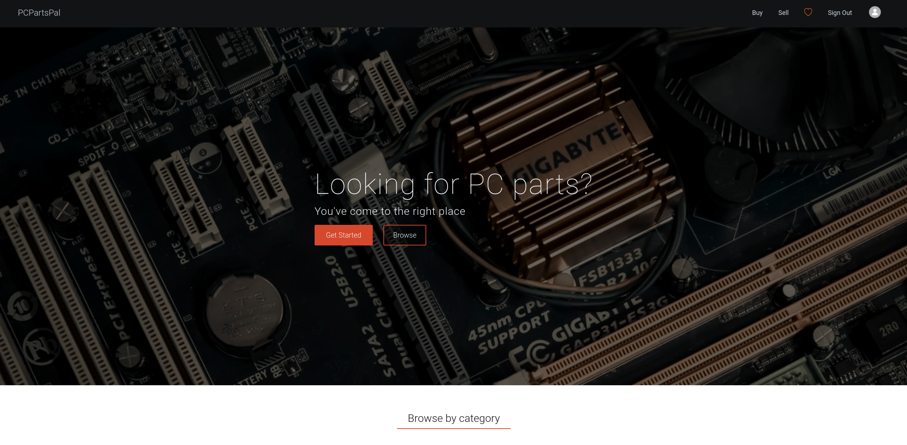
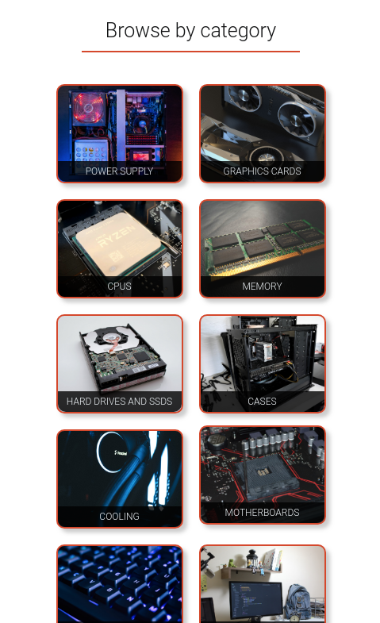
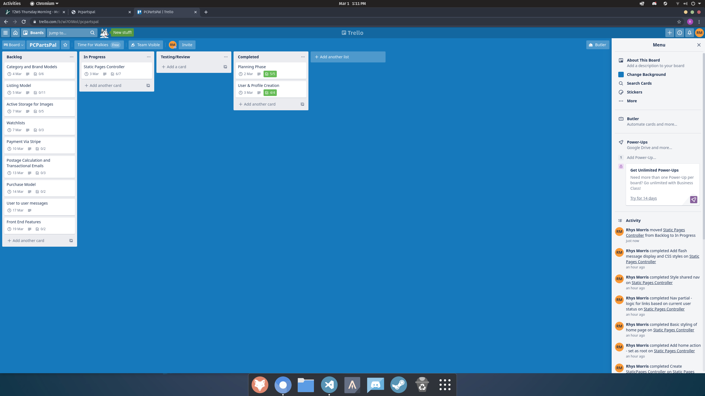

# PCPartsPal 

## Deployed app
[http://pcpartspal.herokuapp.com](http://pcpartspal.herokuapp.com)


## Github repository:
[https://github.com/Rhys-Morris/pcpartspal](https://github.com/Rhys-Morris/pcpartspal)

<br>
<hr>
<br>

## Identification of the problem you are trying to solve by building this particular marketplace app.

<br>

The problem this application attempts to solve is the lack of a focused, quality marketplace for second hand computer parts. I propose there is an opportunity to disrupt the current market competitors and create an application that fills this niche.

<br>
<hr>
<br>

## Why is it a problem that needs solving?

<br>

Currently the main mediums for selling second hand computer parts are eBay, facebook marketplace and Gumtree. 

Each have their own distinctive advantages, and disadvantages, discussed below.

### Facebook marketplace:

Facebook marketplace is not user friendly, particularly from the perspective of a potential buyer. The user interface is clunky, and not particularly easy to navigate from personal experience. Furthermore, it is very difficult to accurately search for listings you are interested in; listings displayed to the user are heavily algorithm driven - the application shows users what it thinks they want to see rather than allowing user's the freedom to navigate. 

The major advantage of Facebook marketplace is the ability to list items for free, and the ease of communication with another user. As Facebook marketplace is built upon the social platform of Facebook, there is an advantage in being able to see who you are dealing with. This builds trust in a sale. Furthermore, messenger is a platform most user’s should already have strong familiarity with. The community aspect of facebook is also important, as it allows groups to form around special interests, for example, PC building, or PC buying. This provides another medium for targeting prospective buyers and has been well integrated into the Facebook marketplace experience. 

### eBay

eBay is a powerhouse in the second hand market, however, it is broad. eBay is an excellent platform for searching for listings based on desired characteristics. This is possibly its greatest strength. eBay is also a platform that is well trusted, most people have some experience using it. It also allows for the reviewing of both buyers and sellers, which helps application users to determine how trustworthy a commerce partner is ahead of a deal. User to user communication is good, although is not as strong as Facebook's platform. 

The major disadvantage of eBay is the fees associated with selling. When we also take into account the fees for 3rd party services such as PayPal, eBay sales fees can reach close to 14% of the final fee. This is not ideal. Furthermore there is no community aspect to eBay, it simply functions as a buying and selling platform. 

### Gumtree

Gumtree sits somewhere in the middle. Again, it does not attempt to fill a specific niche and operates as a buying/selling platform across multiple markets. In my experience Gumtree has better searching capabilities than facebook marketplace, and overall has a decent user experience. However, the platform has stagnated recently and is sorely in need of competition. 

Lack of fees is another pro for Gumtree, however, in order to improve a listings visibility as a seller you either need to be be excellent at taking photos and marketing a listing, or you need to pay to feature your listing more prominently.

Whilst each of these platforms have their own distinctive pros and cons, there is no preminent, focused marketplace for the sale of second hand computer parts. This is the niche I intend to fill. 

My aim for this application is to first build a clean, user friendly buying/selling platform (for assignment submission), with a view to potentially expanding into social aspects at a later date. 

<br>
<hr>
<br>

## Description of your marketplace app (website):

<br>

### Purpose:

To serve as a two-way marketplace for the buying and selling of computer parts between users of the application.

<br>

### Functionality / features

- Create an account and profile.
- Update profile image utilising cloud storage with Amazon S3.
- Create a listing to sell a computer part. 
- Add multiple images associated with a listing utilising cloud storage with Amazon S3.
- Browse other user’s listings to purchase a desired computer part.
- Filter all available listings by price, condition, brand, category and distance to more easily find desired listings.
- Calculate distance between current user and listings using geocoding.
- Sort filtered listings by date added and price.
- Add listings to a watchlist, viewable on a user’s personal profile page.
- A user-to-user in application messaging system
- Calculate postage options for a listing based on buyer and seller locations using the Australia post API.
- Purchase a listing via Stripe.
- View, and update own listings on user profile page. 
- View purchased listings on user profile page.
- Leave a review for a purchased item via purchases tab of user profile.
- View feedback received on user profile page.
- View sold listings on user profile page.
- Delete account.
- Fully responsive design.

<br>

### Sitemap:

<br>


<br>

### Screenshots:

<br>

#### Home

<br>







<br>

#### Listings 

<br>


<br>

#### Listing Show Page

<br>


<br>

#### Profile Page

<br>


<br>

#### Message Inbox

<br>


<br>

#### Conversations

<br>


<br>

### Target audience

<br>

The target audience for this application is anyone who wishes to buy, or sell a privately owned computer part. Ultimately, the aim is to engage members of the PC building community, as they are likely to be the core users of the application. 

<br>

### Tech stack (e.g. html, css, deployment platform, etc)

- PostgreSQL relational database
- Ruby
- Rails
- HTML 5
- CSS 3
- SASS
- JavaScript
- Deployment: Heroku

<br>
<hr>
<br>

## User stories:

<br>

- As a user I want to be able to make a listing so that I can sell my second hand or non-required PC parts.
- As a user I want to be able to delete a listing I have made if it is no longer available for sale, or I change my mind about selling it.
- As a user I want to be able to update a listing I have made with new details, or to fix incorrect current details.
- As a user I want to know whether the part I am interested in purchasing is used or new.
- As a user I want details regarding the brand and item description when I am interested in purchasing a listing.
- As a user I want to be able to filter listings to more easily find the items I am interested in purchasing. 
- As a user I want to be able to sort listings by price and date added to more easily find listings I am interested in purchasing.  
- As a user I want to be able to search listings by title to more easily find listings I am interested in purchasing.  
- As a user I want to be able to see (multiple) pictures of the item I am interested in purchasing to verify it is in the condition stated.
- As a user I want a watchlist to track other user’s listings I’m interested in so that I can easily refer to them at a later date.
- As a user I want to be able to view my current listings on my profile so that I can easily alter them.
- As a user I want to be able to view my sales on my profile so that I can easily track them.
- As a user I want to be able to send a message to another user regarding a listing to negotiate on price or ask further questions. 
- As a user I want to be given an estimate on postage for item’s I am interested in purchasing.
- As a user I want to be able to securely purchase listings online.
- As a user I want to be able to provide feedback on a listing to let other user’s know whether  the transactional experience I had with another user was positive or negative. 
- As a user I want to be able to view feedback I have received to improve my sales.
- As a user I want to be able to view the items I have purchased in my profile to easily recall my purchase history. 
- As a user I want to be given invoice details regarding an item I have purchased to prevent issues with non-receipt of goods.

<br>
<hr>
<br>

## Wireframes:

<br>

### Home Page:

<br>


<br>

## Listings Index:

<br>


<br>

### Listing Show:

<br>


<br>

### Profiles:

<br>


<br>

### Conversations:

<br>


<br>

### Form Templates:

<br>


<br>

### Listing Card Template:

<br>


<br>
<hr>
<br>

## ERD:


<br>
<hr>
<br>

## Explain the different high-level components (abstractions) in your app

<br>

This application is web-based. It is accessible to a user through any client browser e.g. Google Chrome, FIrefox, Safari. HTML requests are sent from the client browser to the Heroku server on which the application is hosted, and then routed through the Rails backend to the specified Rails Controller action.

For example, a simple `GET` request to https://pcpartspal.herokuapp.com/, will be routed to the Static Pages Controller and `#home` action. This `GET` request can be initiated by a user typing the above URL into the browsers address bar and hitting the enter key. New requests are initiated by a user as they navigate the application. For example, clicking on a navbar element will initiate a new `GET` request to render a specific page, whereas a create listing form submit button will initaie a `POST` request, that is routed to a different Controller action.

Once a request has been routed to a specific controller action, the controller will request required data from the appropriate application Models. For example, if the client has requested the index page for all listings (https://pcpartspal.herokuapp.com/listings), the listings must first be retrieved from an applications database prior to a response being sent to the client. This interfacing with the database to retrieve relevant data is handled by the Model. In this scenario the Listing model would ask the database for all listings via `Listing.all`. The data regarding the listings can be saved as an instance variable within the controller, which allows the data to be passed to the view. Data within this application is stored in a postgreSQL relational database as entities within tables. 

The view is the part of the application that renders a response (most commonly in the format of a HTML page) to return to the client. It uses the information sent from the controller alongside Ruby logic to create desired HTML elements. This is achieved via the `html.erb` file extension, which informs Rails that Ruby logic has been written into this HTML page, and needs to be pre-processed into regular HTML prior to returning a response to a client. This is great as it allows us as the application developer to perform tasks such as iterating over an array of listings programmatically and creating a HTML 'card' for each listing. This specific scenario is another great use case for view partials which are essentially snippets of `html.erb`. Partials can be rendered within a parent `html.erb` file to prevent repetitive code. For example, for this project I created listing cards that were used in multiple pages and only differed in the specific listing information e.g. title, price, image etc. I used a partial called  `listing-card.html.erb` to render individual cards. Similarly repetitive elements such as the navigation bar, footer and flash messages were also rendered as partials. 

Prior to returning the response to the client Rails applications also make use of the asset pipeline to bring in any specified assets, such as images, CSS stylesheets and JavaScript. For example to add a JavaScript script to a specific page, it can be requested to be included via `<%= javascript_pack_tag "exampleScript.js %>`. This prevents scripts from loading on pages they're not required, or it makes no logical sense to include them. 

<br>
<hr>
<br>

## Detail any third party services that your app will use

<br>

### Amazon S3 cloud storage

Listing and profile images are stored inside an Amazon Web Services S3 (Simple Storage Service) bucket. This means user uploaded images do not need to be stored inside the application itself, improving the scalability and long term performance of the application. 

### Stripe:

Striple handles online purchases and payments for listings within the application. When a user clicks on the purchase button on a listing page, the listing ID and selected postage option (see below) are sent to the `ListingsController#stripe_session` action on the back end. This action creates a new stripe sesssion with the given listing and postage cost, and returns the session ID as JSON to the front end. This is handled asynchronously via the JavaScript Fetch API on purchase button click event. Once the response is received, Javascript is used to retrieve the session ID and redirect to a new Stripe checkout. From here Stripe handles the input of payment details. Once checkout is completed, Stripe sends a Webhook notification to the application which then handles the necessary logic e.g. setting a listings sold attribute to true and creating a new purchase.  

### Australia Post Postage Calculator:

The Australia Post API was used to calculate the postage cost for domestic parcel delivery. This API requires details regarding a llistings length, height, width and weight, which are provided by a user when the listing is created. The API also requires a 'from' and 'to' postcode, which are represented in the application by a sellers location and buyers location. This information is passed to the API via a HTML `GET` request. Each attribute e.g. listing width is provided as a query parameter. The API then responds with JSON data that contains information regarding the possible postage options for a listing, and the cost of each. I used this information to populate a select input on the front end. the user is then able to select a postage option based on its price, and this cost is dynamically added to a new Stripe session should the user proceed to purchase. 

### Gmail

User's are sent confirmation emails on account sign up and payment completion. This is handled within the application by Rails Action Mailer, however, in order to work correctly Action Mailer needs access to an email provider to ensure the email is actually sent. Options for this include Gmail, SendGrid and Mailgun. I chose to use Gmail as it was deemed the best fit for the nature of this application (educational/non-commercial). In order to correctly set Gmail up within the application, I set up 2-step verification on my Google Account. I was then able to create an app password within my Google account and provide the Gmail account name and app password to `config/production.rb`, ensuring the password was correctly hidden using `rails credentials:edit`. 

### [Australian Suburbs JSON Data](https://github.com/michalsn/australian-suburbs)

This data regarding Australian suburbs, and their associated postcodes was used to seed the database with location options. Inside `seed.rb` I requested the JSON data via a HTML `GET` request, then pulled out the information I required and used it to create new `Location` instances.

<br>
<hr>
<br>

## Describe your projects models in terms of the relationships (active record associations) they have with each other

<br>

In this section I will briefly run through each model in my application and look at their active record associations. Each active record association for a model will be listed and its purpose clarified in plainer text. 

### Listings

Alongside Users, Listings are the core model of the application. The following active record associations apply to the `Listing` model:

- `belongs_to :category`
    - Each listing has only one associated brand e.g. AMD, NVIDIA, Logitech.
- `belongs_to :brand`
    - Each listing has only one associated category e.g. Monitors, Mice/Keyboards.
- `belongs_to :user`
    - Each listing can be made by a single application user.
- `has_many_attached :images`
    - Each listing can have multiple images attached via Active Storage, which are uploaded to Amazon S3 cloud storage, or potentially no associated images.
- `has_many :watches` & `has_many :profiles, through: :watches`
    - Each listing can be added to multiple user's watchlists, visible in their user profile under the watchlist tab.
- `has_one :purchase`
    - Each listing can only be purchased once.
- `has_one :review`
    - Once purchased a listing can only be reviewed by the purchaser of the item.

### Users

Representative of the user's of the application. The following active record associations apply to the `User` model:

- `has_one :profile`
    - Each user has only one associated profile.
- `has_many :listings`
    - Each user can create multiple listings, or have zero listings.
- `has_many :purchase`
    - A user can purchase multiple listings, or zero listings.
- `has_many :review`
    - A user can have multiple associated reviews for each of their listings, these reviews are viewable via a user's profile.
- `has_many :messages`
    - Each user can create multiple user-to-user messages, or no messages.
- `belongs_to :location`
    - Each user has one associated location, consisting of city, state and postcode. This location is the basis for geocoding a latitude and longitude on the User model.

### Brands

The following active record associations apply to the `Brand` model.

- `has_many :listings`
    - Each brand potentially has many, or no, associated listings.

### Categories

The following active record associations apply to the `Category` model.

- `has_many :listings`
    - Each category potentially has many, or no, associated listings.

### Locations

The following active record associations apply to the `Location` model.

- `has_many :users`
    - Each location potentially has multiple associated users, or no associated users.

### Conversations

The following active record associations apply to the `Conversation` model.

- `belongs_to :sender, class_name: "User"`
    - Each conversation has a sender, who is a user of the application.
- `belongs_to :receiver, class_name: "User"`
    - Each conversation has a receiver, who is a user of the application.
- `has_many :messages`
    - Each conversation can have many associated messages between sender and recipient.

### Messages

The following active record associations apply to the `Message` model.

- `belongs_to :conversation`
    - Each message is associated with a single conversation between two users.
- `belongs_to :user`
    - Each message is created by a single user, the sender.

### Profiles

The following active record associations apply to the `Profile` model.

- `belongs_to :user`
    - Each profile is associated with a single user and created on user registration.
- `has_many :watches` & `has_many :listings, through: :watches`
    - Each profile can have many associated listings watched via a watchlist
- `has_one_attached :image`
    - Each profile has one attached image stored via Active Storage via Amazon S3 cloud , or no attached image.

### Purchases

The following active record associations apply to the `Purchase` model.

- `belongs_to :user`
    - A purchase can only belong to one user.
- `belongs_to :listing`
    - A purchase is only associated with a single listing.

### Reviews

The following active record associations apply to the `Review` model.

- `belongs_to :user`
    - A review is made regarding a single listing seller.
- `belongs_to :listing`
    - A review is made regarding a single purchased listing.

### Watches

The following active record associations apply to the `Watch` model.
- `belongs_to :listing`
    - A watched item is a single listing.
- `belongs_to :profile`
    - A watched item is associated with a single user's profile. 

<br>
<hr>
<br>

## Discuss the database relations to be implemented in your application

Extrapolating from the above active record associations, and the provided ERD, each database relation can be identified. I have chosen to do this as a list with both sides of each database association listed beside one another. The complete set of database relations that exist in this application are as follows:

1. A listing has one brand. A brand can have many listings (or none). This is a one-to-many relation.
2. A listing has one category. A category can have many listings (or none). This is a one-to-many relation. 
3. A listing has one user. A user can have many listings (or none). This is a one-to-many relation. 
4. A user has one profile. A profile has one user. This is a one-to-one relationship.
5. A user has one location. A location can have many users (or none). This is a one-to-many relation.
6. A conversation has two users (sender and recipient). A user can have many conversations (as both sender and recipient). This is is a unique case where there is a one-to-many relationship between a user as a sender and conversations, and a one-to may relationship between a user as a recipient and conversations.
7. A conversation has many messages. A message has one conversation. This is a one-to-many relationship.
8. A message has one user. A user can have many messages. This is a one-to-many relationship.
9. A profile has many listings, through watches. A listing has many profiles, through watches. This is a many-to-many relationship where watches is the join table. 
10. A user has many potential purchases. A purchase has one user. This is a one-to-many relationship.
11. A listing has one potential purchase. A purchase has one listing. This is a one-to-one relationship.
12. A user has many potential reviews. A review has one user. This is a one-to-many relationship.
13. A listing has one potential review. A review has one listing. This is a one-to-one relationship.
14. A listing has many attached images as active_storage_blobs through active_storage_attachments. Active_storage_attachments is a polymorphic table that links a lisitng to active_storage_blobs. A blob contains the metadata regarding an image and how to retieve it from Amazon S3 cloud storage. 
15. A profile has one attached image as an active_storage_blob through active_storage_attachments. Active_storage_attachments in this scenario links the a profile to a single active_storage_blob (the profile image).

In reference to the ERD the above relationships can be noted by the joining lines between tables.

A one-to-one relationship where both sides of the relationship are mandatory is represented as:


This is best exemplified by the relationship between profiles and users. The two vertical lines indicate the relationship is 'one' and 'mandatory'.

A one-to-one relationship where one side is mandatory and the other side optional is represented as:


This is best exemplified by the relationship between a listing and a review. A review for a listing is optional, but a listing must exist for a review to exist. This 'o' prior to the vertical line indicates the relationship is 'one' and 'optional'.

A one-to-many relationship where both the many side of the relationship is optional is represented as:


This is exemplified by the relationship between messages and conversations. A conversation can have many messages, but a message must belong to a conversation. The crows foot appearance to the line end indicates that the relatinship is many, again a 'o' preceding it marks the relationship as optional. If a vertical line were preceding the crows foot the relationship is recognised as mandatory. 

A many-to-many relationship is represented through a join table. This is visible in the ERD looking at the relationship between profiles and listings that is linked as a many-to-many (optional) through the watches join table.


<br>
<hr>
<br>

## Comments on database schema design

A database schema file refers to the organisation of data within a relational database. It can be thought of as a blueprint for how a database is constructed. 

The schema can be altered through database migrations, which can be used for a myriad of purposes including:

- creating tables
- dropping (removing) tables
- adding new attributes (columns) to tables
- adding associations between tables (foreign keys)
- creating database indexes 

If we look at the following, create_table "listings" block within the schema:

```
  create_table "listings", force: :cascade do |t|
    t.string "title"
    t.text "description"
    t.float "price"
    t.boolean "sold", default: false
    t.integer "condition"
    t.bigint "category_id", null: false
    t.bigint "brand_id", null: false
    t.bigint "user_id", null: false
    t.datetime "created_at", precision: 6, null: false
    t.datetime "updated_at", precision: 6, null: false
    t.boolean "reviewed"
    t.integer "length"
    t.integer "height"
    t.integer "width"
    t.float "weight"
    t.index ["brand_id"], name: "index_listings_on_brand_id"
    t.index ["category_id"], name: "index_listings_on_category_id"
    t.index ["user_id"], name: "index_listings_on_user_id"
  end
```

This listings table is initially created through the migration file `/home/rhys-morris/coder-academy/marketplace/pcpartspal/db/migrate/20210228070433_create_listings.rb`:

```
class CreateListings < ActiveRecord::Migration[6.1]
  def change
    create_table :listings do |t|
      t.string :title
      t.text :description
      t.integer :price
      t.boolean :sold, default: false
      t.integer :condition
      t.references :category, null: false, foreign_key: true
      t.references :brand, null: false, foreign_key: true
      t.references :user, null: false, foreign_key: true

      t.timestamps
    end
  end
end

```

 This initial migration is visibly not identical to the representation of the listings table within the schema. Notable by their absence are the data attributes: reviews, length, height, width and weight. These attributes were added to the listings table through a later migration `/home/rhys-morris/coder-academy/marketplace/pcpartspal/db/migrate/20210308051856_add_columns_to_listings.rb`:

 ```
 class AddColumnsToListings < ActiveRecord::Migration[6.1]
  def change
    add_column :listings, :reviewed, :boolean
    add_column :listings, :length, :integer
    add_column :listings, :height, :integer
    add_column :listings, :width, :integer
    add_column :listings, :weight, :float
  end
end
 ``` 

In this manner the schema file is incrementally altered to respond to added application features as the project progresses.

Looking at the listings table schema above, the data type is identified after `t.` in each block line. For example the column "price" is led by `t.float`, identifying the data type as a float. 

The lines led by `t.index` are referencing a database index, which is an ordered data structure (another table) that is presorted to make queries upon it more performant. It is a way of sacrificing space in a database to improve query speed.

At the bottom of the schema file we have a section that outline the foreign keys between tables:

```
  add_foreign_key "active_storage_attachments", "active_storage_blobs", column: "blob_id"
  add_foreign_key "active_storage_variant_records", "active_storage_blobs", column: "blob_id"
  add_foreign_key "listings", "brands"
  add_foreign_key "listings", "categories"
  add_foreign_key "listings", "users"
  add_foreign_key "messages", "conversations"
  add_foreign_key "messages", "users"
  add_foreign_key "profiles", "users"
  add_foreign_key "purchases", "listings"
  add_foreign_key "purchases", "users"
  add_foreign_key "reviews", "listings"
  add_foreign_key "reviews", "users"
  add_foreign_key "users", "locations"
  add_foreign_key "watches", "listings"
  add_foreign_key "watches", "profiles"
```

We can identify relationships between tables by examining the created foreign keys. For example we can see that there is a relationship between listings and brands, but it cannot be inferred if this is a one-to-one or one-to-many relationship based on the schema file alone, just that a relationship exists.

<br>
<hr>
<br>

## Describe the way tasks are allocated and tracked in your project

<br>

Tasks for this project were allocated and tracked via a Trello board utilising Agile project management. Several small tasks were created as Trello cards and added to my backlog. Each task was designated a rough due date and number of ‘subtasks’ required to complete the overall task. These subtasks were tracked using Trello’s inbuilt checklist feature for cards. 

As each card was worked on, the card was moved from my backlog to `In Progress`. Once each subtask was completed, the card was moved to testing/review awaiting appropriate automated unit tests or manual testing. Once I was happy that the task/feature had been correctly implemented and passed various test conditions, the card was moved to completed. Screenshots of this incremental progression are viewable below.  

Git source control was used throughout the project. I utilised a continuous deployment pipeline via Heroku and automatic deployment from Github. A screenshot of the staging and production deployment can be seen below. The staging deployment was set to be autodeployed on each push to the `dev` branch of my Github repository. The production branch was manually deployed. 

For each major feature I would create a new git branch. Once the feature was implemented in a manner I was satisfied with, a pull request was raised to merge the changes into the `dev` branch. In regular intervals (at least daily), a pull request would be raised to merge `dev` into `main`.

Heroku Deployment Pipeline:


Link to Trello Board: [Link](https://trello.com/b/wi7OIWol/pcpartspal)

Trello Board Screenshots:





